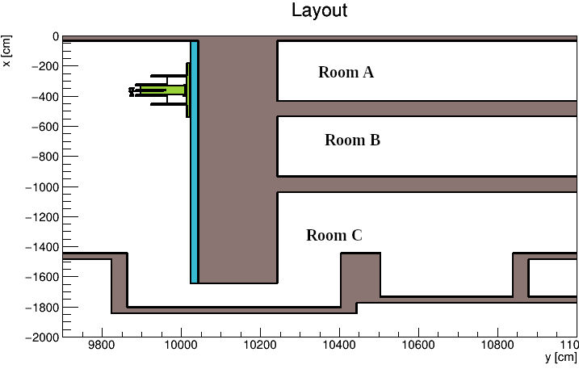
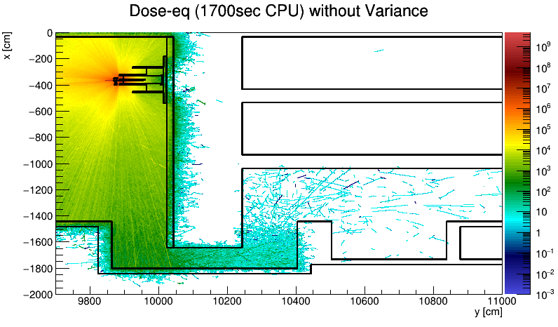
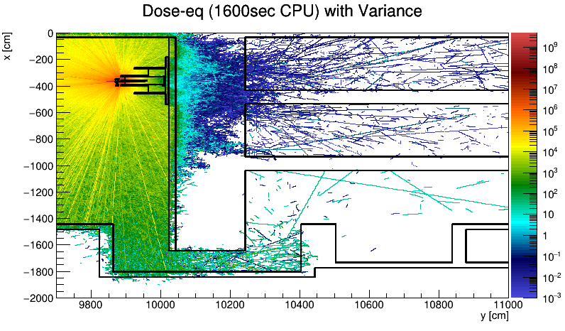

# FLUKA Variance Mesh

The modifications that is needed to build mesh based variance reduction 
into the FLUKA particle physics Monte-Carlo simulation package
(https://fluka.org).

# Introduction

FLUKA provides the physics engine for simulating nuclear/particle
physics interactions with matter. The code is able to simulate geometries
up to 100000 cells using the Monte-Carlo method. However, in many cases
the region of interest (e.g. behind a thick wall) is under-sampled, relative
to other regions within the problem (e.g. in front of the wall). Typically
variance reduction methods are applied to such problems to modify the sampling
domain. 

FLUKA only provides cell based and global particle based variance
reduction.  However, it does provide a subroutine (USIMBS) that can
allow the user to provide functions for variance reduction, which is
called at every collision. This package provides a mesh based importance
system via this subroutine. The intent is to use a few meshes to cover the 
volumes which are most important and not the whole model. This is a different
philosophy from MCNP(X).

# Prerequisites

* The FLUKA code is typically provided with a binary release and this
code required that the latest binary version has been installed. 

* The expectation is that the user is familiar with Linux operating system
and runing FLUKA with large models. The code does not itself built the 
variance reduction mesh (it just allows FLUKA to use int) so there will
be some writing scripts to generate the USRICALL cards for the 
input file is expected (or modifing their codes that are used 
to generate thier FLUKA input files.) 
Currently, [CombLayer](https://github.com/SAnsell/CombLayer)
supports automatic generation of the USRICALL cards for its FLUKA
output mode (and was used to write the example here). However, this
code is fully independent of any generation code.

# Installation

* The code should be downloaded into a separate directory from the FLUKA
directory. The standard FLUKA environment variable FLUPRO needs to have been
set. All other FLUKA variable e.g. GFORTRAN etc are not used/respected. 

* The build system is based on a Makefile. The Makefile is likely to
need to be edited. Currently there are three variable that need to be
changed: First is the variable GCCNUM and the second is the variable
EXTLIB and thirdly CPPLIB.

* GCCNUM is simply the gcc number that the FLUKA build was downloaded for
(and is on your computer). EXTLIB points to the **static** libraries
that you will need to compile FLUKA, and CPPLIB points to the
libstdc++ static library. If your system is different that additional
libraries can be added here.

* GCCNUM has not been directly tested below 9.2.1 (potential C++17
issues in the code). However, it is reasonably easy to code round this
if it is a problem (even it the code gets a bit more verbose). The
performance of gcc-8 will be lower than gcc-9 for the C++ part of the
code.

**Notes:** 

* A static build has been chosen because it is expected that any
user of a variance reduction system will be using a cluster. Many
clusters are heterogeneous (have multiple different types of
processors) and the convenience of compiling once on a local machine,
checking if it will work and copying the binary to the cluster and
knowing it will work identically, seems to far outweigh the benefit that
shared libraries provide. If this is not acceptable, change the
libraries accordingly.

## Compiling

* Hopefully, compiling in simply a matter of running *make*
The output should be *flukahp* and *flukadpm3*. The command 
*ldd flukahp* should show that it is a static build. 

## Execution 

* Execution of the code is via the normal FLUKA methods, e.g. with the rfluka
tool, but setting a direct execution path e.g.
*rfluka -e ~/MyFlukaVariance/flukahp -N0 -M1 test.inp*

# Principle of mesh system

This modification provides a set of meshes over a rectilinear grids
that are independent of the geometry. Each mesh is a four dimensional
object, three dimensions are the standard orthogonal axis and the last
dimension is over energy. 

Each mesh's 3D grid is (currently) only along the models X/Y/Z of the
main model. 

The meshes are ordered by index number: at each event, the position,
particle type and energy ofthe particle is used to determine the weight.
Starting with the lowest index number (typically index 1), the code determine
is the point is withint the mesh volume, the energy in within the energy
range and the particle is valid for that mesh. If that is true, then 
the weight is referenced from this mesh, if it is not true the next 
mesh (typically index 2) is checked and so on. Thus meshes with
lower index values have priority over higher mesh indexes.

This can be used to put a fine mesh within a larger course mesh by having
the fine mesh at a lower mesh index number. 
In the event that a particle is outside of all the
meshes, then the standard FLUKA cell based variance reduction weight is
used.

# Adding a Meshed-Base Importance system to a model

* Variance reduction is most likely done by starting from a valid FLUKA
input file that can be run. There are a number of commands that are
interpreted by the calls to subroutine USRINI.

* Before any use of a user bases importance system is possible, all the 
regions that are being used need to be set with the BIASING (sdum=USER) 
card. This card can be used to set all cells but this is inefficient
in a large model if the mesh is focused on one volume. It can also be
used to put a mesh around a complex object and ignore the outer cells (for
example on a set of slits and ignore the supports).

# The user setup card

* The mesh is setup using a large number of USRICALL cards. There are five types
which are set by the SDUM unit.

- - **wwgEng** : energy bins values
- - **wwgPart** : particle number
- - **wwgSize** : NX NY NZ bin sizes for mesh
- - **wwgLow** : Lower corner of mesh
- - **wwgHigh** : Upper corner of mesh
- - **wwg** : Mesh point values

Each card has 6 what values (W1,W2,W3,W4,W5,W6) in addition to the SDUM value.
All five, to be the index value of the mesh that is being constructed,
e.g. 1,2,3... 

* **wwgEng** is followed by a list of energy values [in order] in **GeV**.
There needs to be at least two values to define at least one bin if the 
card is given. There is no default.

* **wwgPart** is followed by a list of FLUKA particle numbers (or -1/-2 for
all hadron, or photon/electron type). If not given then all particle are 
considered valid.

* **wwgLow** is the lower left corner of the mesh grid. It is in absolute coordinates. There is no default.

* **wwgHigh** is the upper right corner of the mesh grid. It is in absolute coordinates. There is no default.

*It is important that the coordinate in wwgLow and wwgHigh are in the positive
direction so that wwgLow.x < wwgHigh.x, wwgLow.y < wwgHigh.y, and 
wwgLow.z < wwgHigh.z.* 

* **wwgSize** provides the number of bins in x,y,z grid. Minimum number is 1.
There is no default.

* **wwg** is the primary cell based system. It is indexing: energyBin
(W2), xBin (W3), yBin (W4), zBin (W5) and the bins are numbered
from 1. The value is placed in W6. The value is given as the negative
root of the log value.  Variance value is NOT importance, it is using the
system of weight that is familiar with MCNP(X), PHITS, Adjoint. It is
simply the inverse of importance. Acceptable values are all less
than 0. Note that rounding errors can occur is the values are
difficult to represent in floating point (e.g. values less than -150).

# Generating a useful weight mesh

This code does not generate the weight mesh for the user, it only
reads and processes the mesh within FLUKA. In principle, the mesh
could be written by hand, however that is extremely in-practical,
unless the mesh is a one/two/three cell mesh. There exist a number of
codes to provide meshes
e.g. [ADVANTG](https://info.ornl.gov/sites/publications/files/pub46035.pdf)
and the weight window they they generate could be rapidly converted to
this format by writing a small script.

The example here was generated from
[CombLayer](https://github.com/SAnsell/CombLayer). This program allows
the generation of the complete output file including the weight window
mesh.  CombLayer provides an method of rapidly building
rotating, displacing, morphing and inserting components into a fulll model,
which facilitates the construction of construct of very large facility wide
models. The CombLayer maintains a fully geometric representation
(before writing the FLUKA input file) and can use 
geometric tracking to construct the weight window
meshes, using the geometry, material and density of the model.

# Example

* The example given is taken from a highly simplified model of a beam
dump at the end of an electron linac.  It can be build from CombLayer using 
the command written in the header of BeamStop_Variance.inp.

* Model description: The model shows a possible intermediate 
beam dump design of an electron linac. Figure Layout
shows a simple overlay of the geometry in plan view at the beam height. 

* The beam come from the left (y=9800cm) and hits a beamdump (marked in green).
There are large concrete walls (marked in gray) and thinner 
steel wall marked in blue.

* The calculation is to determine the dose in rooms A and rooms B. The
input files are given as BeamStop_Variance.inp and BeamStop_NoVariance.inp. There are 
identical files except that variance reduction has been added to 
BeamStop_Variance.inp.

* Two meshes were added to BeamStop_Variance.inp, the first is a low
gradient mesh over the beamdump itself, for intermediate energy
particles only. The second is across a section of the wall, which is a
higher gradient mesh, and over low and intermediate energies.

* A result after identical length of total CPU time has been plotted
in figures Variance.png and NoVariance.png.  [using
[Mc-Tools](htts://github.com:kbat/mc-tools.git) maintained by
Konstantin Batkov.]  It shows both the expected acceleration of the
simulation into Room A and Room B, and the reduction in sampling for
both back reflected particles and for the transport and this albedo
scattered round the maze into Room C.

* The gain in acceleration is about 3 orders of magnitude in this
simulation for the direct forward going scattering. It is important
that when variance reduction is being used that this modifies the
overall sampling phase space. It is only possible to increase the
sampling in one area by decreasing it in another area. There is no
universally correct variance reduction, only the correct variance
reduction for the a specific investigation.

# Warnings

* The performance of all Monte-Carlo codes is dependent on both direct
CPU computation and the ability to search memory for library
values. The current code allows the building of arbitary sized
meshes. In testing (on some rather old hardware), the addition of
large meshes (and/or large usrbin tallies) resulted in a dramatic
(x50) slowdown due to cache/memory page faults. This was not shown in
the CPU time but the wall clock time of each run.  Care should be
taken, particularly, running > 1M pixel meshes.

# Additions

Code was left in the project for construction of multi-order magnet
fields (dipole,quad etc) and a system for sampling a source from a
file. It is not necessary to use this but it shows the standard method
of calling C++ from FLUKA and is convenient for those users who are building
full synchrotron and accelerator models. Replace as needed.

# License

This code is released under GPL-3. 

# Contacts

* e-mail: stuart.ansell [аt] maxiv.lu.se

* List of authors : Stuart Ansell

# See Also

[http://fluka.org](http://fluka.org)

[https://github.com/SAnsell/CombLayer](https://github.com/SAnsell/CombLayer)

[https://github.com/github.com/kbat/mc-tools](https://github.com/github.com/kbat/mc-tools)
